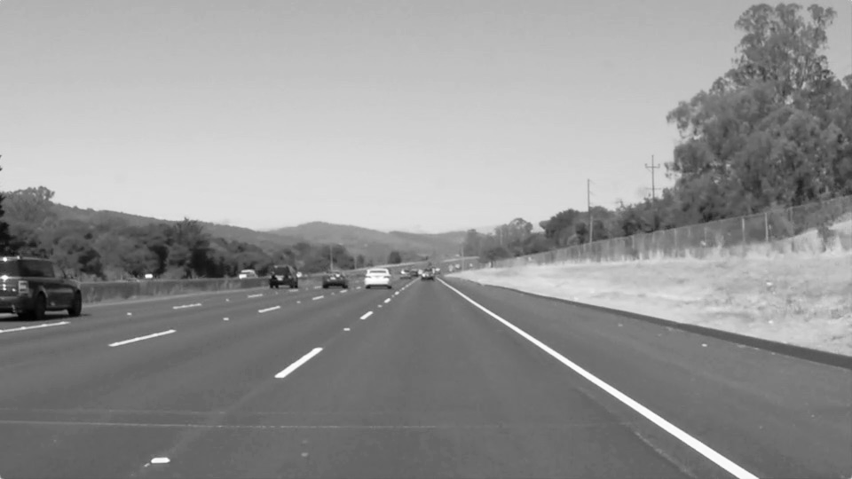
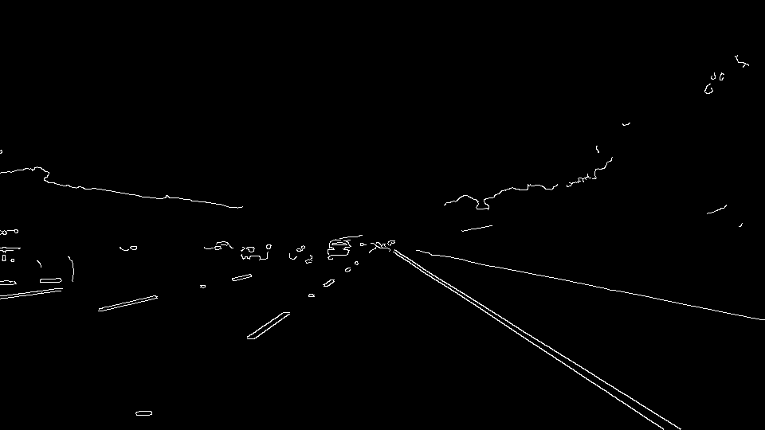
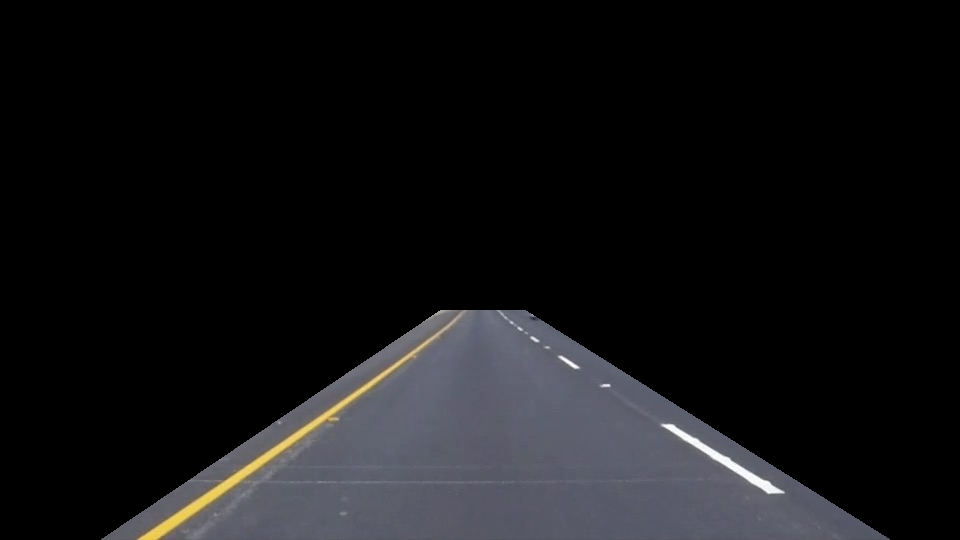
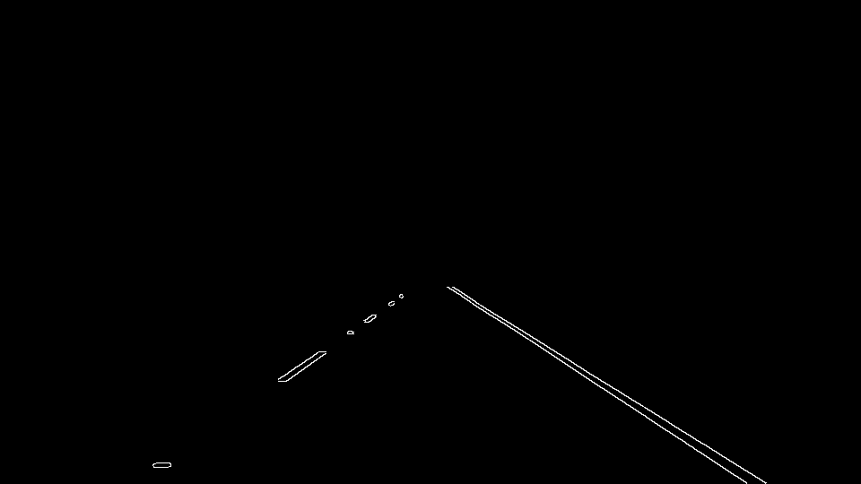
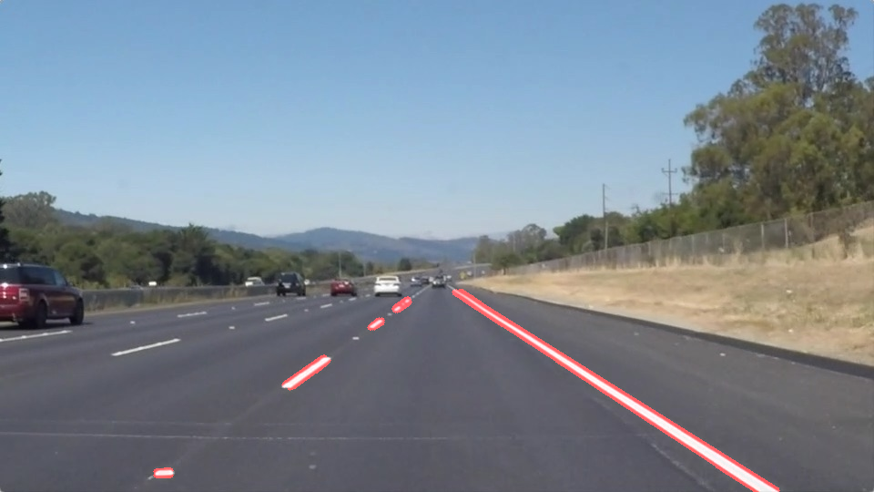
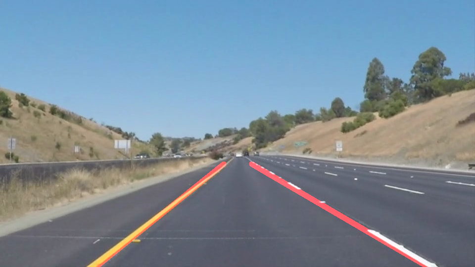

# **Finding Lane Lines on the Road** 

## **Reflection**

### My pipeline consisted of 6 step.

1. **Grayscale** - The original image is 3 channel, this function turn it into 1 channel.
<p align="center">
    
</p>

2. **Gaussian blur** - Run Gaussian smoothing, before running Canny will get better effect. Here I set the mask (5, 5).
<p align="center">
    
</p>

3. **Canny edge detector** - A method of edge detection.
<p align="center">
    
</p>

4. **Mask image** - Remove unuseful areas.
<p align="center">
    
        
</p>

5. **Line image** - Using cv.HoughLinesP and cv.line function to draw line.
<p align="center">
    
</p>

6. **Weighted images** - Add two images together (one is or original image and anther is line image)
<p align="center">
    
</p>

## **draw_lines Function**
### In order to draw a single line on the left and right lanes, I modified the draw_lines() function like down, you can divide it into 5 step.

```
# draw line parameters, the parameters need reset berfor running function
x_1_pre, x_2_pre, y_1_pre, y_2_pre = [0, 0], [0, 0], [0, 0], [0, 0]
run_count = 0

def draw_lines(img, lines, color=[255, 0, 0], thickness=10):
    global x_1_pre, x_2_pre, y_1_pre, y_2_pre, run_count
    ymax1 = 0
    ymax2 = 0

    # 1. Find the two longest lines in left and right
    x_1, y_1, x_2, y_2 = [0, 0], [0, 0], [0, 0], [0, 0]
    for line in lines:
        for x1,y1,x2,y2 in line:
            if (y1 - y2) > 0:
                if abs(y1 - y2) > ymax1:
                    x_1 = [x1, x2]
                    y_1 = [y1, y2]
                    ymax1 = abs(y1 - y2)
            else:
                if abs(y1 - y2) > ymax2:
                    x_2 = [x1, x2]
                    y_2 = [y1, y2]
                    ymax2 = abs(y1 - y2)
                    
    # 2. TO avoid lines change too big, can resist some interference
    dx1 = [(x_1_pre[0] - x_1[0]), (x_1_pre[1] - x_1[1])]
    dx2 = [(x_2_pre[0] - x_2[0]), (x_2_pre[1] - x_2[1])]
    dy1 = [(y_1_pre[0] - y_1[0]), (y_1_pre[1] - y_1[1])]
    dy2 = [(y_2_pre[0] - y_2[0]), (y_2_pre[1] - y_2[1])]
    dup = 10
    ddown = 5
    if run_count > 5:
        if dup > abs(dx1[0]) > ddown or dup > abs(dx1[1]) > ddown or \
           dup > abs(dy1[0]) > ddown or dup > abs(dy1[1]) > ddown:
            x_1 = [x_1_pre[0] - int(dx1[0] / 5), x_1_pre[1] - int(dx1[1] / 5)]
            y_1 = [y_1_pre[0] - int(dy1[0] / 5), y_1_pre[1] - int(dy1[1] / 5)]
        elif abs(dx1[0]) > dup or abs(dx1[1]) > dup or \
             abs(dy1[0]) > dup or abs(dy1[1]) > dup:
            x_1 = x_1_pre
            y_1 = y_1_pre
        if dup > abs(dx2[0]) > ddown or dup > abs(dx2[1]) > ddown or \
           dup > abs(dy2[0]) > ddown or dup > abs(dy2[1]) > ddown:
            x_2 = [x_2_pre[0] - int(dx2[0] / 5), x_2_pre[1] - int(dx2[1] / 5)]
            y_2 = [y_2_pre[0] - int(dy2[0] / 5), y_2_pre[1] - int(dy2[1] / 5)]
        elif abs(dx2[0]) > dup or abs(dx2[1]) > dup or \
             abs(dy2[0]) > dup or abs(dy2[1]) > dup:
            x_2 = x_2_pre
            y_2 = y_2_pre
    else:
        run_count += 1

    # 3. Averag lef and right lines
    # averag the X-axis point
    dw = (x_2[0] - x_1[1]) / 2
    x_1[1] = int(width / 2 - dw)
    x_2[0] = int(width / 2 + dw)
    # averag the Y-axis point
    dh = (y_2[0] - y_1[1]) / 2
    y_2[0] = int(y_2[0] + dh)
    y_1[1] = int(y_2[0] + dh)
        
    # 4. Make sure lines can connect to images bottom
    if x_1[0] != 0:
        c = (x_1[1] - x_1[0]) / (y_1[1] - y_1[0])
        x_1[0] = int(x_1[0] - (y_1[0] - height) * c)
        y_1[0] = height
    if x_2[1] != 0:
        c = (x_2[0] - x_2[1]) / (y_2[0] - y_2[1])
        x_2[1] = int(x_2[1] - (y_2[1] - height) * c)
        y_2[1] = height
        
    # 5. updata
    x_1_pre = x_1
    y_1_pre = y_1
    x_2_pre = x_2
    y_2_pre = y_2
    ymax_pre = max(ymax1, ymax2)
    cv2.line(img, (x_1[0], y_1[0]), (x_1[1], y_1[1]), color, thickness)
    cv2.line(img, (x_2[0], y_2[0]), (x_2[1], y_2[1]), color, thickness)
```

## The Final Output
[Output video] - All output videos is in this folder. 

<p align="center">
    
</p>

## 2. Identify potential shortcomings with your current pipeline

* If the image lost the path, then **draw_line function** can't found two longest line, 
and I have met this problem in **challenge video**, so I make the **draw_line funtion** (in function step2.) more better, 
but it still have many bug to fix.

* Another problem I met is images size, there may be many different images sizes, then this will result **Mask image function** unuseful.

## 3. Suggest possible improvements to your pipeline

* Paramrter tuning
* reset the Mask image funcion size
* More determine the conditions to avoid error
* And I think in the future course, we will use **Convolutional Neural Networks(CNN)** to improve it!


[Output video]: https://github.com/KUASWoodyLIN/Udacity-self-driving-car-challenge-1/tree/master/test_videos_output
